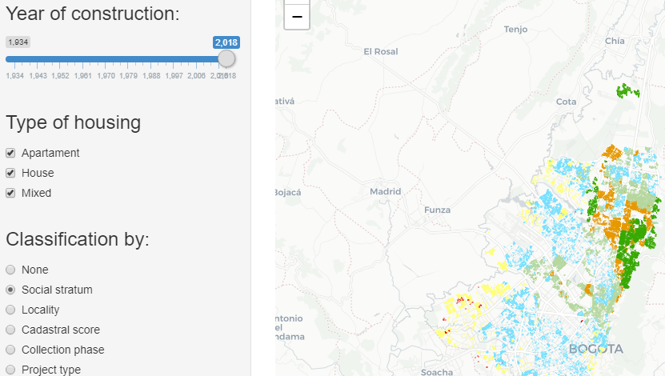

```{r setup, include=FALSE}
knitr::opts_chunk$set(echo = FALSE)
```

## The app:



## Data

Data was obtained from [bogota maps website](https://mapas.bogota.gov.co/) by searching "Censo PH" (or horizontal property census, in english).

Data contains the communal equipment information on horizontal property buildings in Colombia's capital, Bogota.

This data comes from a total of 18,179 buildings in the city and the equipment holding of amenities like swimming pools, security systems, cinemas, sport courts, etc.

## Custom slide and options for mapping

<center></center>

as shown above, you can customize and filter map data with 3 inputs: Year of construcion of the building, type of housing and a classification.

In the following example we can see "Social stratum" as the selected option, this will show living places according to its socioeconomic classification (Throughout Colombia, houses, homes, apartments and other buildings are given a number on a scale of 1-6, with 6 being the highest on the socio-economic scale and 1 being the lowest).

## Resulting map
<center></center>
shiny app is available [right here](https://andresfpalaciosc.shinyapps.io/Week4DDP/) and github repository can be seen [here](https://github.com/andresfpc/DDPWeek4Assignment).
